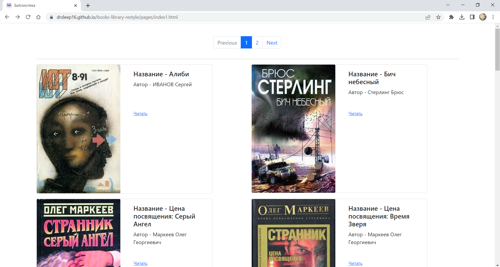

## Как использовать скрипт для скачивания книг с сайта tululu.org

Этот скрипт позволяет скачивать книги с сайта [tululu.org](https://tululu.org), а так же выводить собственную библиотеку книг. Скрипт может скачивать текстовые файлы книг и обложки, а также извлекать информацию о книгах и сохранять её в JSON-файл.

### Установка зависимостей

Чтобы установить эти зависимости, выполните следующие шаги:

1. Перейдите в каталог, содержащий файл `requirements.txt`.

2. Откройте командную строку (терминал) и выполните следующую команду:

   ```bash
   pip install -r requirements.txt
   ```

   Эта команда автоматически установит все пакеты и версии, указанные в файле `requirements.txt`.
### Использование

1. Скопируйте скрипт `main.py` в свой рабочий каталог.

2. Откройте командную строку (терминал) и перейдите в каталог, где находится скрипт `main.py`.

3. Запустите скрипт с помощью командной строки, указав следующие параметры:

   ```
   python main.py <start_page> <end_page> [--skip_imgs] [--skip_txt]
   ```

   - `<start_page>`: Номер начальной страницы для скачивания книг (обязательный параметр).
   - `<end_page>`: Номер последней страницы для скачивания книг (обязательный параметр).
   - `--skip_imgs`: Опциональный флаг для пропуска скачивания обложек книг. Если этот флаг указан, обложки не будут скачиваться.
   - `--skip_txt`: Опциональный флаг для пропуска скачивания текстовых файлов книг. Если этот флаг указан, текстовые файлы не будут скачиваться.

4. Примеры использования:

   - Для скачивания всех книг с 1-ой по 10-ую страницу:
     ```
     python main.py 1 10
     ```

   - Для скачивания только информации о книгах (без скачивания файлов) с 5-ой по 15-ую страницу:
     ```
     python main.py 5 15 --skip_imgs --skip_txt
     ```


### Дополнительная информация

#### Как это работает

1. Скрипт начинает с указанной начальной страницы и заканчивает на указанной последней странице.
2. Для каждой страницы получает список URL-ов книг с помощью функции `get_urls_books` из модуля `parse_tululu_category.py`.
3. Затем скрипт поочередно переходит по каждому URL-у книги и собирает информацию о книге, включая заголовок, автора, жанры, комментарии и ссылку на обложку.
4. Если указан флаг `--skip_imgs`, скрипт пропускает скачивание обложек, иначе скачивает обложки в папку "images".
5. Если указан флаг `--skip_txt`, скрипт пропускает скачивание текстовых файлов книг, иначе скачивает их в папку "books".
6. Информация о каждой скачанной книге сохраняется в JSON-файле "book_parse.json".


### Описание файла `render_website.py`

Этот скрипт Python, `render_website.py`, предназначен для динамической генерации статических HTML-страниц на основе данных из JSON-файла и шаблона HTML. Сгенерированные страницы разбиваются на несколько частей, и добавляются навигационные элементы для переключения между страницами.

## Как это работает

1. **Импорт библиотек:**
   - Сначала импортируются необходимые библиотеки и модули, такие как `json`, `os`, `more_itertools`, `math`, `jinja2`, и `livereload`.

2. **Функция `rebuild`:**
   - Функция `rebuild` выполняет следующие шаги:
      - Открывает JSON-файл `"media/book_parse.json"`, содержащий данные о книгах, и загружает его в переменную `books`.
      - Разбивает список книг на несколько страниц, где каждая страница содержит до 20 книг, используя модуль `more_itertools.chunked`. Результат сохраняется в переменной `book_pages`.
      - Рассчитывает общее количество страниц `total_pages`, округляя вверх результат деления общего количества книг на 20.
      - Затем проходит по каждой странице книг, используя цикл `for`, и для каждой страницы:
        - Загружает шаблон HTML из файла `"template.html"` с помощью Jinja2.
        - Рендерит HTML, передавая данные о книгах, текущей странице и общем количестве страниц.
        - Сохраняет сгенерированный HTML в файл с именем `"pages/index{page_num}.html"`, где `{page_num}` - номер страницы.

3. **Основной блок:**
   - В основном блоке кода выполняется следующее:
     - Проверяется, если директория `"pages"` не существует, то она создается с помощью `os.makedirs`.
     - Затем вызывается функция `rebuild()`, чтобы сгенерировать страницы при запуске скрипта.
     - Создается объект `Server()` из библиотеки `livereload`, который следит за изменениями в файле `"template.html"` и автоматически пересоздает страницы при их изменении.
     - Запускается сервер для раздачи страниц с корневой папки `''`.

Этот скрипт позволяет создавать многостраничный веб-сайт на основе данных из JSON и шаблона HTML, а также обеспечивает автоматическое обновление страниц при изменении шаблона.

### Сайт: https://drsleep16.github.io/books-library-restyle

### Скриншот сайта:

#### Дополнительные файлы

- `check_for_redirect.py`: Модуль для проверки перенаправления HTTP-запросов.
- `parse_tululu_category.py`: Модуль для получения URL-ов книг из категорий сайта.

### Автор
Мочалов Дмитрий